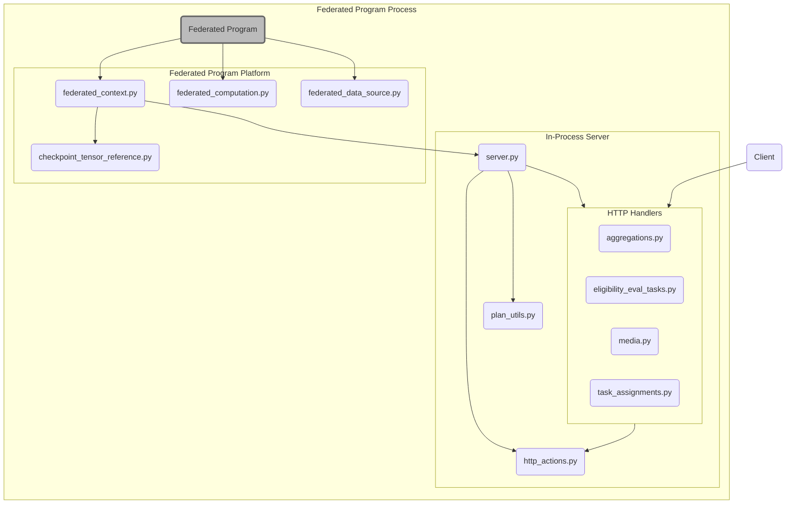

# Cross-Device Federated Computations Demo

This directory contains an example
[Federated Program platform](https://github.com/tensorflow/federated/blob/main/tensorflow_federated/python/program/README.md#platform-specific-components)
implementation that's compatible with the Federated Compute client.

The code in this directory prioritizes understandability over production
scalability because many of the frameworks used to create robust servers are
dependent on the intended deployment environment. Comments throughout the code
and documentation call out where changes should be made for a production
implementation. Unless otherwise noted, the libraries in other directories are
production quality.

See
[Towards Federated Learning at Scale: System Design](https://arxiv.org/abs/1902.01046)
(TFLaS) for additional information on scaling Federated Learning.

## Example Usage

> 💡 See `federated_program_test.py` for a working example of configuring and
> running a Federated Program using this package.

The following example program is based on the example in the
[TFF documentation](https://github.com/tensorflow/federated/blob/main/tensorflow_federated/python/program/README.md#program):

```python
from fcp import demo
from fcp.protos import plan_pb2

# Parameters set by the customer.
_OUTPUT_DIR = flags.DEFINE_string('output_dir', None, 'The output path.')
_POPULATION_NAME = flags.DEFINE_string(
    'population_name', None, 'The identifier for the client population.')
_COLLECTION_URI = flags.DEFINE_string(
    'collection_uri', None,
    'A URI identifying the example collection to read from.')


def main():
  # Parameters set by the program.
  total_rounds = 10
  num_clients = 3

  # Configure the platform-specific components.
  with demo.FederatedContext(
      _POPULATION_NAME.value,
      base_context=tff.framework.get_context_stack().current) as context:
    data_source = demo.FederatedDataSource(
        _POPULATION_NAME.value,
        plan_pb2.ExampleSelector(collection_uri=_COLLECTION_URI.value))

    # Configure the platform-agnostic components.
    summary_dir = os.path.join(_OUTPUT_DIR.value, 'summary')
    output_managers = [
      tff.program.LoggingReleaseManager(),
      tensorboard_manager = tff.program.TensorBoardReleaseManager(summary_dir),
    ]
    program_state_dir = os.path.join(..., 'program_state')
    program_state_manager = tff.program.FileProgramStateManager(
        program_state_dir)

    # Define the computations.
    initialize = ...
    train = ...

    # Execute the computations using program logic.
    tff.framework.set_default_context(context)
    train_federated_model(
        initialize=initialize,
        train=train,
        data_source=data_source,
        total_rounds=total_rounds,
        num_clients=num_clients,
        output_managers=output_managers,
        program_state_manager=program_state_manager)
```

## Code Structure



### Client

The [Federated Computations Client](../client)
library is used by applications running on end-user devices to run
server-defined computations over on-device data and report back results (such as
updated model weights) to be aggregated by the server.

> 💡 See `federated_program_test.py` for command-line flags that should be used
> when running `//fcp/client:client_runner_main`.

> ⚠️ The client requires TLS when connecting to any host other than `localhost`.
> The server's public and private keys will need to be provided to the
> `demo.FederatedContext` constructor, and the corresponding CA certificate will
> need to be passed to the client library (e.g., via `--test_cert` for
> `client_runner_main`).

### Federated Program Platform

The demo Federated Computations platform is a
[Federated Program platform](https://github.com/tensorflow/federated/blob/main/tensorflow_federated/python/program/README.md#platform-specific-components)
implementation that allows TFF computations to be run using Federated
Computations Clients.

A production implementation could reuse much of this code as-is, though
`federated_context.py` would need to be updated to communicate with remote
server(s) instead of an in-process server.

#### `federated_context.py`

Contains a
[`tff.program.FederatedContext`](https://www.tensorflow.org/federated/api_docs/python/tff/program/FederatedContext)
implementation for running computations on the demo Federated Computations
platform.

This module uses libraries in
[`fcp/artifact_building`](../artifact_building) to
convert TFF computations to the format expected by the
[in-process server](#in-process-server) and [client](#client).

#### `federated_computation.py`

Contains a
[`tff.Computation`](https://www.tensorflow.org/federated/api_docs/python/tff/Computation)
subclass for computations that will be run by the demo Federated Computations
platform.

#### `federated_data_source.py`

Contains a
[`tff.program.FederatedDataSource`](https://www.tensorflow.org/federated/api_docs/python/tff/program/FederatedDataSource)
implementation for representing on-device data sources.

#### `checkpoint_tensor_reference.py`

Contains a
[`tff.program.MaterializableValueReference`](https://www.tensorflow.org/federated/api_docs/python/tff/program/MaterializableValueReference)
implementation that reads values from a TensorFlow checkpoint.

### In-Process Server

An in-process HTTP(S) server that implements the
[Federated Compute protocol](../protos/federatedcompute).
This server is responsible for selecting which clients will contribute to each
computation invocation (**task**), broadcasting computations and state to
clients, aggregating the results of on-device computation, and incorporating
that aggregate information back into the model or metrics.

In a production implementation, each Federated Compute protocol service would
likely be handled by a separate replicated microservice, not a Python module.

#### `server.py`

Provides the interface for setting up and stopping the in-process HTTP(S) server
and running computations provided by the `FederatedContext`. This module is
responsible for notifying the various Federated Compute protocol service
implementations when a new task has been added and then managing the lifecycle
of that task.

#### `eligibility_eval_tasks.py`

Contains handlers for the Federated Compute protocol's
[EligibilityEvalTasks](../protos/federatedcompute/eligibility_eval_tasks.proto)
service. This service is responsible for serving optional pre-task-assignment
computations that determines to which tasks each client is eligible to
contribute. The demo platform does not currently support configuring Eligibility
Eval tasks; clients are considered to be eligible for all tasks.

#### `task_assignments.py`

Contains handlers for the Federated Compute protocol's
[TaskAssignments](../protos/federatedcompute/task_assignments.proto)
service. This service is responsible for either assigning each client to a
task -- or rejecting the client.

#### `aggregations.py`

Contains handlers for the Federated Compute protocol's
[Aggregations](../protos/federatedcompute/aggregations.proto)
service. This service is responsible for aggregating client-reported data using
the
[simple Aggregation Protocol](../aggregation/protocol/simple_aggregation)
library.

Note that the demo platform does not currently contain an implementation of the
[SecureAggregations](../protos/federatedcompute/secure_aggregations.proto)
service.

#### `media.py`

Contains handlers for HTTP uploads and downloads using `PUT` and `GET` requests.

A production implementation will likely replace this module with a
deployment-environment-specific download service; a custom upload service
implementation may be needed since it should not persistently store
client-uploaded data.

#### `http_actions.py`

Contains helper functions for converting proto-based handlers into HTTP
handlers. This conversion mimics the Cloud Endpoints
[HTTP to gRPC transcoding](https://cloud.google.com/endpoints/docs/grpc/transcoding).

#### `plan_utils.py`

Contains helper functions for constructing the TensorFlow graph and input
checkpoint used by the client and running TensorFlow-based post-processing on
aggregated results.
